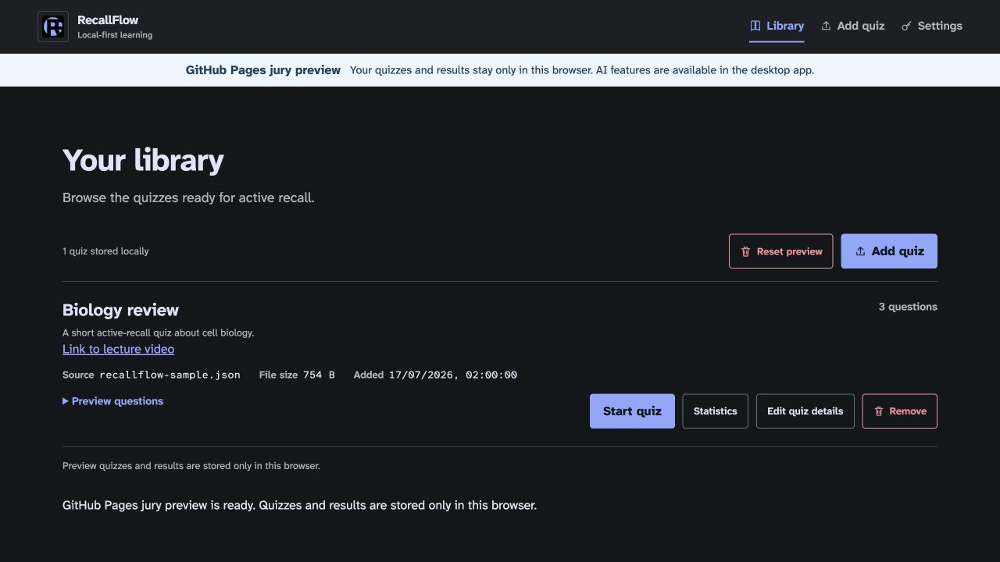
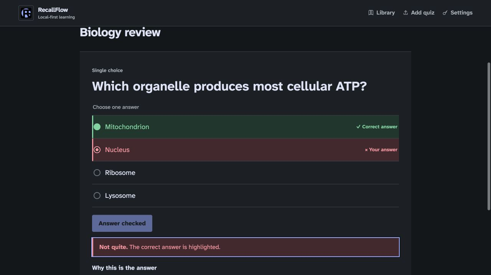
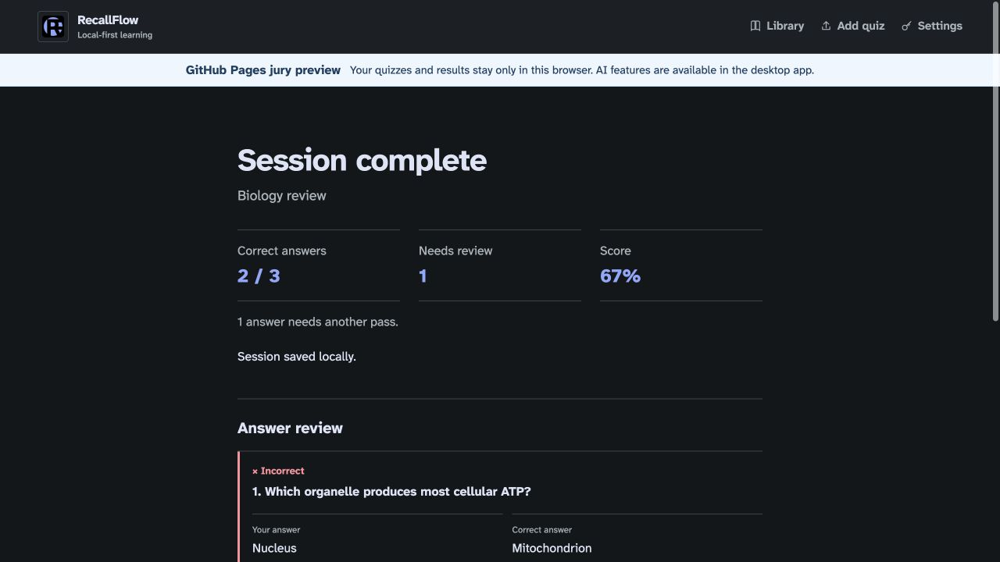
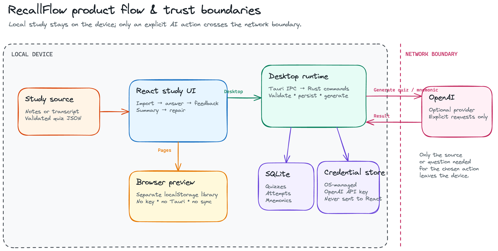

# RecallFlow

RecallFlow turns notes and transcripts into quizzes for active-recall practice
that stays under the learner's control. The implemented flow is simple:
add a validated quiz, answer single-choice, multiple-choice, or true/false
questions, review immediate feedback and explanations, then revisit missed
answers in a repair session and track saved results.

The desktop app is local-first. React renders the study experience while a
Tauri/Rust backend owns SQLite persistence, operating-system credential access,
and provider requests. A RecallFlow account or hosted backend is not required
for importing, studying, or reviewing local quizzes. AI is optional and
explicit: the current UI uses OpenAI for quiz and mnemonic generation, and
study content leaves the device only after the learner chooses a generation
action. The API key is stored in the operating system credential store and is
never returned to React.

[Try the browser preview](https://martynawitkowska.github.io/recallflow_poc/).
It is a separate, browser-only library backed by this site's local storage. It
does not use Tauri IPC, SQLite, desktop credentials, or AI requests, and its
data does not sync with the desktop app.

## What is implemented

- **Local quiz library:** import and validate RecallFlow JSON, preview questions,
  edit the quiz title and optional lecture link, or remove local data.
- **Active-recall sessions:** study single-choice, multiple-choice, and
  true/false questions with keyboard-friendly controls, immediate answer
  feedback, explanations, focus mode, and complete answer review.
- **Progress and recovery:** save attempts locally, inspect per-quiz accuracy
  and session history, study again, or repair only the questions missed in the
  previous session.
- **Optional desktop AI:** use OpenAI to generate a grounded quiz from pasted
  material or a public page, review the draft before saving, and cancel longer
  runs. After an incorrect answer, generate and locally save an optional
  mnemonic.
- **Local preferences:** choose a reading font and whether new quizzes begin in
  focus mode. Offline state keeps local study available while disabling network
  generation.

## Product tour

These captures use the browser preview's deterministic, synthetic biology quiz.
They contain no user study material, credentials, notifications, or personal
paths.



*The local library keeps quiz management, study actions, and storage boundaries
visible together.*



*Immediate feedback identifies both selections with text and color, then keeps
the explanation in the same study flow.*



*A completed session saves locally, summarizes recall, and begins the review
that powers a focused repair pass.*

## Runtime and architecture

| Surface | Local storage | Network boundary |
| --- | --- | --- |
| Desktop app | Quizzes, attempts, and saved mnemonics in `recallflow.sqlite3`; preferences in the local WebView profile; OpenAI key in the operating-system credential store | Rust contacts OpenAI only after an explicit quiz or mnemonic generation action |
| GitHub Pages preview | Seeded and imported quizzes, attempts, and preferences in browser local storage for the preview origin | No provider calls, API-key input, Tauri IPC, or desktop storage access |



*Local study remains inside the device boundary. Only an explicit generation
action reaches OpenAI. The diagram is also available as an
[editable Excalidraw source](docs/assets/architecture/recallflow-overview.excalidraw).*

The desktop request path is deliberately narrow:

1. [`src/components/`](src/components/) renders accessible UI states.
2. [`src/hooks/`](src/hooks/) coordinates asynchronous user flows.
3. [`src/lib/`](src/lib/) validates browser data and wraps Tauri IPC.
4. [`src-tauri/src/commands/`](src-tauri/src/commands/) handles desktop
   requests in Rust.
5. [`src-tauri/src/database.rs`](src-tauri/src/database.rs) initializes SQLite,
   while [`src-tauri/src/credentials.rs`](src-tauri/src/credentials.rs) isolates
   credential-store access and the generation modules own provider traffic.

The Pages build follows a different branch in the TypeScript storage wrappers,
so it never substitutes browser data for desktop persistence. See the
[architecture and data-flow guide](docs/architecture.md) for the complete
component, contract, storage, and failure-path map, and the
[security model](docs/security-model.md) for credential and provider details.

## Browser preview

The [live jury preview](https://martynawitkowska.github.io/recallflow_poc/)
starts with a deterministic sample quiz. It supports JSON import, study
sessions, feedback, summaries, repair sessions, statistics, metadata editing,
deletion, and non-secret preferences. Preview quiz files are limited to 500 KB.

Preview data survives refreshes in the same browser profile, but it is not
synced or backed up. Clearing site data or using **Reset preview** discards the
preview library and restores the sample quiz. For a browser-only alternative
to built-in generation, the app can copy a RecallFlow JSON prompt for use in an
AI service chosen by the learner; only the resulting local JSON file is then
imported into the preview.

## Prerequisites

- Node.js 22 and npm, matching the repository's GitHub Pages workflow.
- The stable Rust toolchain with Cargo.
- The [Tauri 2 system prerequisites](https://v2.tauri.app/start/prerequisites/)
  for the development operating system.
- On Linux, an unlocked Secret Service-compatible keyring is required only for
  desktop API-key storage. Importing and studying local quizzes does not need an
  AI provider account or key.

## Setup

```sh
git clone https://github.com/martynawitkowska/recallflow_poc.git
cd recallflow_poc
npm ci
```

`npm ci` installs the locked frontend and Tauri CLI dependencies. Cargo resolves
the locked Rust dependencies when a desktop or validation command first runs.

## Development and validation

| Command | Purpose |
| --- | --- |
| `npm run desktop:dev` | Start the Tauri desktop app with Vite hot reload |
| `npm run dev` | Start Vite for browser layout work; desktop-only actions report that Tauri is required |
| `npm run build` | Type-check and create the production frontend in `dist/` |
| `npm run check` | Run the frontend build and checks, Rust formatting check, `cargo check`, and all Rust tests |
| `npm run build:pages` | Build the browser-only Pages artifact in `dist/` |
| `npm run preview:pages` | Serve the existing Pages artifact locally |

The automated suite uses deterministic local fixtures and mocked provider
responses; it does not contact provider APIs or use developer credentials.
Manual happy- and failure-path guidance lives in the
[resilient UI states](docs/resilient-ui-states.md),
[keyboard navigation](docs/keyboard-accessibility.md), and
[contrast and screen-reader](docs/contrast-and-screen-reader-audit.md) reviews.

## Security and privacy

- Local library and study activity does not require a RecallFlow server.
- The desktop WebView never receives a full API key. React sends a new key once
  to Rust, which stores it in macOS Keychain, Windows Credential Manager, or
  Linux Secret Service; subsequent UI status contains only configured state and
  an optional masked suffix.
- Pasted material is sent to OpenAI only after **Generate quiz**. URL generation
  gives OpenAI the supplied public URL and permits web search for that page.
  Mnemonic generation sends the current question, correct answer, and optional
  explanation only after **Create mnemonic**.
- Saved quizzes and attempts are not uploaded automatically. Provider handling
  of explicitly submitted content follows the provider account's terms.
- Imported quiz content and real credentials are excluded from tests and public
  documentation. Accessibility states do not depend on color alone, and native
  controls preserve standard keyboard and assistive-technology behavior.

Read the full [security model](docs/security-model.md) and the
[grounded-generation design](docs/grounded-generation.md) before changing IPC,
storage, or provider behavior.

## Current limitations

- Built-in quiz and mnemonic generation currently supports OpenAI only.
- The requested quiz question count is a maximum. Grounding and quality checks
  may return fewer questions or none; generated drafts still require review.
- URL generation requires a public page readable without signing in.
- The Pages preview has no AI generation, desktop persistence, credential
  access, or synchronization with the desktop app.
- RecallFlow has no built-in cloud synchronization or backup service.

## Packaging

Create a native installer or application bundle for the current operating
system:

```sh
npm run desktop:build
```

Artifacts are written below `src-tauri/target/release/bundle/`. Cross-platform
packages must be built on the target operating system with its Tauri
prerequisites. Release signing and distribution credentials are intentionally
not stored in this repository.

## Documentation

- [Architecture and data flow](docs/architecture.md)
- [Security model](docs/security-model.md)
- [Grounded quiz generation](docs/grounded-generation.md)
- [Resilient UI states](docs/resilient-ui-states.md)
- [Keyboard navigation and focus audit](docs/keyboard-accessibility.md)
- [Contrast and screen-reader audit](docs/contrast-and-screen-reader-audit.md)
