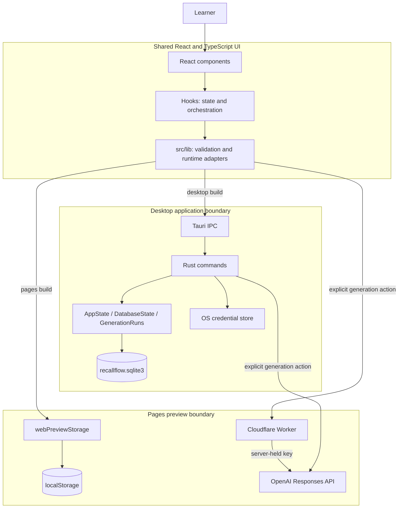

# RecallFlow architecture and data flow

This document describes the implemented architecture on this branch. It is the
canonical map of runtime boundaries and data movement; the
[security model](security-model.md) is the canonical source for credential,
provider-disclosure, and hardening details.

RecallFlow has two deliberately separate runtimes:

- the desktop build uses the shared React UI with Tauri IPC, Rust, SQLite, the
  operating-system credential store, and explicit provider requests;
- the GitHub Pages build uses the shared React UI with a browser-only local
  storage adapter and has no Tauri, SQLite, or credential access. An optional
  server-side endpoint provides tightly limited pasted-material generation.

There is no RecallFlow account, hosted application backend, synchronization,
or automatic upload path in either runtime.

## System boundary map



The arrows show possible calls, not automatic movement. In particular, the
OpenAI edge is used only after **Generate quiz** or **Create mnemonic**.

## Layers and responsibilities

| Layer | Responsibility | Current implementation |
| --- | --- | --- |
| Application shell | Own the active view, selected quiz, repair/focus mode, non-secret preferences, and top-level navigation | [`src/App.tsx`](../src/App.tsx) |
| Display components | Render library, import, generation, study, summary, statistics, settings, connectivity, and recovery states | [`src/components/`](../src/components/) |
| Hooks | Coordinate asynchronous loads, saves, generation, cancellation, retry, and stale-request suppression | [`src/hooks/`](../src/hooks/) |
| TypeScript boundary | Validate quiz files and returned payloads, choose the Pages or desktop adapter, and centralize safe IPC errors | [`src/lib/`](../src/lib/) |
| Tauri bootstrap | Resolve the application data directory, initialize SQLite and managed state, register commands, and apply desktop capabilities | [`src-tauri/src/lib.rs`](../src-tauri/src/lib.rs) and [`src-tauri/capabilities/default.json`](../src-tauri/capabilities/default.json) |
| Rust commands | Expose narrow application operations for library, attempts, credentials, and generation | [`src-tauri/src/commands/`](../src-tauri/src/commands/) |
| Serialized models | Keep the Rust side of the camel-case TypeScript contracts explicit | [`src-tauri/src/models.rs`](../src-tauri/src/models.rs) |
| Local persistence | Create and query the quiz and attempt tables through sqlx | [`src-tauri/src/database.rs`](../src-tauri/src/database.rs) |
| Credentials | Validate, mask, read, replace, and delete provider keys through the operating-system store | [`src-tauri/src/credentials.rs`](../src-tauri/src/credentials.rs) |
| Provider pipeline | Validate requests, segment and ground pasted material, call provider adapters, verify results, and sanitize output | [`src-tauri/src/generation/`](../src-tauri/src/generation/) |
| Pages persistence | Validate and persist a separate versioned preview library and attempts in browser local storage | [`src/lib/webPreviewStorage.ts`](../src/lib/webPreviewStorage.ts) |
| Pages generation | Validate a limited pasted-material request and call a server-side endpoint without exposing a provider key | [`src/lib/quizGeneration.ts`](../src/lib/quizGeneration.ts) and [`worker/`](../worker/) |

Components do not invoke RecallFlow application commands directly. A component
delegates to a hook, the hook calls a feature wrapper in `src/lib/`, and only
the wrapper reaches [`invokeIpc`](../src/lib/ipc.ts). This keeps runtime choice,
contract parsing, and safe command errors outside display code. The narrow
exception is [`ExternalLink`](../src/components/ExternalLink.tsx), which calls
Tauri's opener plugin for an already validated HTTP(S) lecture link.

## Desktop data flows

### Import, study, and review

1. [`FileDropzone`](../src/components/FileDropzone.tsx) gives a selected file
   to [`useQuizFileImport`](../src/hooks/useQuizFileImport.ts).
2. [`readQuizFile`](../src/lib/readQuizFile.ts) accepts a non-empty `.json` file
   up to 5 MB and parses it. [`validateQuiz`](../src/lib/validateQuiz.ts) checks
   the application schema and normalizes supported fields.
3. [`useQuizLibrary`](../src/hooks/useQuizLibrary.ts) adds local identifiers and
   import metadata, then [`quizLibrary.ts`](../src/lib/quizLibrary.ts) invokes
   `save_imported_quiz`.
4. The Rust library command serializes the quiz into `imported_quizzes.quiz_json`.
   Listing reverses the path and TypeScript validates the returned `unknown`
   payload again before components receive it.
5. [`QuizSession`](../src/components/QuizSession.tsx) keeps current selections
   and checked answers in React memory. Finishing produces a `QuizResult`;
   [`useQuizAttemptSave`](../src/hooks/useQuizAttemptSave.ts) converts it to a
   `QuizAttempt`, and `save_quiz_attempt` persists the score and missed question
   identifiers.
6. [`QuizSummary`](../src/components/QuizSummary.tsx) can start a repair session
   with only missed questions. The resulting attempt records that non-empty
   subset rather than rewriting the quiz.

Deleting one quiz also deletes its attempts. Clearing the desktop library
deletes all quizzes and attempts. A saved mnemonic is normalized and embedded
in that question inside the quiz JSON; it is not a separate table.

### Provider credential lifecycle

1. [`Settings`](../src/components/Settings.tsx) passes a newly entered key to
   [`useApiKeySettings`](../src/hooks/useApiKeySettings.ts).
2. [`apiKeyStorage.ts`](../src/lib/apiKeyStorage.ts) sends the full value once
   in `save_ai_api_key { provider, apiKey }`. Sensitive argument values are
   considered when [`invokeIpc`](../src/lib/ipc.ts) decides whether an error is
   safe to show.
3. Rust validates the value and stores it under the stable service name
   `com.martynawitkowska.recallflow.api-keys` in macOS Keychain, Windows
   Credential Manager, or Linux Secret Service.
4. The response contains only `configured` and `maskedKey`. This display
   metadata is cached best-effort in WebView local storage; the full key is not.
5. A generation command reads the key just before the provider request into a
   zeroizing temporary string. Generation IPC requests have no API-key field.
6. `delete_ai_api_key` removes the credential independently of SQLite data.

There is intentionally no command that returns a full stored key to React.

### Quiz generation

1. [`QuizGenerator`](../src/components/QuizGenerator.tsx) and
   [`useQuizGeneration`](../src/hooks/useQuizGeneration.ts) collect either
   pasted material or one public HTTP(S) URL, a model, and a requested maximum
   of 3–25 questions. Empty, oversized, conflicting, or offline requests stop
   before IPC.
2. [`quizGeneration.ts`](../src/lib/quizGeneration.ts) listens for the
   content-free `quiz-generation-progress` event, then invokes
   `generate_quiz { request, runId }`.
3. Rust revalidates the request, reads the credential, registers a cancellation
   flag in `GenerationRuns`, and starts the generation pipeline.
4. Pasted material is normalized and split into primary regions targeting
   8,000 characters with bounded overlap. Candidate generation, exact evidence
   resolution, independent verification, duplicate removal, and balanced
   selection may return fewer questions than requested. The detailed gates are
   documented in [grounded generation](grounded-generation.md).
5. URL generation sends the supplied public URL and requires OpenAI web search.
   Pasted-material generation does not enable web search.
6. Rust calls `https://api.openai.com/v1/responses` with `store: false`, bounded
   outputs, a request timeout, and strict structured output where applicable.
   Raw response bodies and credential-bearing errors are not forwarded.
7. TypeScript checks the generation result and validates any returned quiz.
   The learner reviews a draft; only a separate save action writes it to the
   local library.

Cancellation signals the run, stops queued application work, ignores late
results, removes the in-memory run entry, and does not save a partial quiz.

### Mnemonic generation

After an incorrect answer, the learner may choose **Create mnemonic**.
[`useMnemonicGeneration`](../src/hooks/useMnemonicGeneration.ts) sends the
current question, correct answers, optional explanation, provider, and model
through `generate_mnemonic`. Rust adds the key, validates an 8,000-character
context bound, calls the provider, and returns a normalized mnemonic of at most
1,000 characters. The mnemonic remains an unsaved UI result until the learner
chooses to save it into the quiz JSON.

## Browser preview data flow

[`isPagesPreview`](../src/lib/runtime.ts) is a build-time Vite mode check. In a
Pages build, the library and attempt wrappers branch before `invokeIpc`:

- quizzes, saved mnemonics, and attempts use the versioned
  `recallflow.pages.data.v1` local-storage record;
- preferences use `recallflow.pages.preferences.v1`;
- preview data is scoped to the deployed origin and browser profile;
- a deterministic synthetic quiz seeds missing or invalid preview storage;
- **Reset preview** replaces preview data with that seed;
- preview quiz JSON is limited to 500 KB even though desktop file import accepts
  files up to 5 MB;
- AI-key settings, mnemonic generation, and URL generation are unavailable, and
  the preview never reads desktop SQLite or operating-system credentials;
- when a public generation endpoint is configured at build time, pasted
  material can be sent explicitly to the Worker for a bounded quiz operation.

The Pages build is therefore not a fallback desktop backend. Its records do not
synchronize with the desktop app, and clearing site data removes them.

## IPC and serialized contracts

Tauri command names are registered in
[`src-tauri/src/lib.rs`](../src-tauri/src/lib.rs). Rust structs use Serde
`camelCase` fields, question types use `snake_case`, and provider values use
lowercase strings.

| Commands | Arguments and results | Owner |
| --- | --- | --- |
| `get_app_info` | no arguments → `{ name, version }` | App state |
| `list_imported_quizzes` | no arguments → `LibraryQuiz[]` | SQLite |
| `save_imported_quiz` | `{ quiz: LibraryQuiz }` → no content | SQLite |
| `save_quiz_mnemonic` | `{ request: { quizId, questionId, mnemonic } }` → updated `LibraryQuiz` | SQLite |
| `delete_imported_quiz`, `clear_imported_quizzes` | quiz identifier or no arguments → no content | SQLite |
| `list_quiz_attempts`, `save_quiz_attempt` | no arguments or `{ attempt: QuizAttempt }` | SQLite |
| `save_ai_api_key`, `delete_ai_api_key` | provider plus a new key when saving → masked `ApiKeyStatus` | OS credential store |
| `generate_quiz` | `{ request: GenerateQuizRequest, runId }` → `GenerationResult`; emits aggregate progress | Rust generation state and provider |
| `cancel_quiz_generation` | `{ runId }` → no content | In-memory generation state |
| `generate_mnemonic` | `{ request: GenerateMnemonicRequest }` → string | Credential store and provider |

The shared quiz shape is `QuizFile { title, description?, videoUrl?, questions }`.
Each question has an identifier, one of `single_choice`, `multiple_choice`, or
`true_false`, answer choices, exact `correctAnswers`, and optional explanation
and mnemonic. `QuizAttempt` stores identifiers, completion time, score, total,
and missed question identifiers. Contract tests reject API keys added to either
generation request.

The current TypeScript UI exposes OpenAI only. Rust contains additional
provider-specific mnemonic adapters, but they are not reachable from the
current provider options and are not an implemented public feature.

## Local data locations and lifetimes

| Data | Location | Lifetime and removal |
| --- | --- | --- |
| Imported/generated quizzes and saved mnemonics | `recallflow.sqlite3`, `imported_quizzes` | Durable across restarts; removed per quiz or by clearing the desktop library |
| Study attempts | `recallflow.sqlite3`, `quiz_attempts` | Durable across restarts; removed with their quiz or when the library is cleared |
| SQLite file | Tauri's platform-specific application data directory | Created at desktop startup; RecallFlow does not sync or back it up |
| Reading/focus preferences, selected model, masked key status | Desktop WebView local storage | Durable for that WebView profile; invalid values fall back to safe defaults |
| Provider API key | Operating-system credential store | Durable until replaced/deleted in Settings or removed through the operating system |
| Active quiz answers, draft quiz, unsaved mnemonic | React memory | Lost when the view or application is closed unless explicitly saved |
| Generation cancellation flags | Rust process memory | Removed when a run finishes or the process exits; they retain no study content |
| Pages quizzes, mnemonics, attempts, and preferences | Local storage for the Pages origin | Durable for that browser profile; removed by reset or clearing site data |
| Provider request data | OpenAI request boundary | Sent only for the selected action; external handling follows provider terms even though requests set `store: false` |

## Trust boundaries and failure paths

| Boundary or failure | Containment and recovery |
| --- | --- |
| Invalid or oversized quiz file | Browser-side parsing and schema validation reject it before persistence and show the file-specific problem |
| Missing desktop runtime | `invokeIpc` rejects the request with a desktop-required message instead of inventing browser persistence |
| SQLite unavailable or incompatible | Startup or commands return stable errors without deleting an incompatible existing quiz table; library/save states offer retry where meaningful |
| Corrupt desktop payload | TypeScript parses returned `unknown` values and refuses a corrupt library or generated quiz |
| Preview storage blocked or full | The Pages adapter reports an actionable storage error; invalid/version-mismatched preview data is replaced with the deterministic seed |
| Missing, invalid, or locked credential | Rust distinguishes missing credentials from an unavailable operating-system store and never echoes the submitted key |
| Offline or provider failure | Local study remains available; hooks block known-offline generation, and Rust maps timeouts, rate limits, refusals, invalid bodies, and server failures to bounded messages |
| Untrusted provider output | Rust applies strict parsing, evidence and verification gates; TypeScript validates the final quiz again; no generated draft is auto-saved |
| Cancelled generation | Run-scoped cancellation stops queued work and prevents partial persistence; progress and cancellation state contain no source text |
| Local save failure | Attempt, mnemonic, generation-draft, and library flows retain an actionable error and a retry or repeat action without uploading data |

The WebView Content Security Policy permits bundled content and Tauri IPC but
not remote scripts or direct provider traffic. Provider HTTP calls originate in
Rust. External lecture links use the narrowly scoped Tauri opener capability
for HTTP(S) URLs.

Accessibility is part of the component boundary: async hooks expose explicit
loading, success, empty, and error states; components announce changes with
status/alert semantics, use native controls, and move focus when views or quiz
questions change. See the [keyboard audit](keyboard-accessibility.md),
[contrast and screen-reader audit](contrast-and-screen-reader-audit.md), and
[resilient UI states](resilient-ui-states.md) for manual checks.

## Consequential design decisions

- **Local-first, not sync-first:** SQLite and origin storage are the systems of
  record for their separate runtimes; there is no hidden hosted data plane.
- **One narrow frontend boundary:** display components do not know Tauri command
  mechanics, making the Pages/desktop split explicit in feature wrappers.
- **Credentials live outside application data:** SQLite backups cannot contain
  provider keys, and React cannot read a full saved key back.
- **Provider requests originate in Rust:** this keeps credentials and raw
  provider responses out of the WebView and supports a restrictive CSP.
- **Generation is review-before-save:** requested counts are maxima, failed
  quality gates are not filled with fabricated questions, and drafts require an
  explicit persistence action.
- **Stable public errors over internal details:** retry guidance crosses IPC;
  platform errors, raw responses, source content, and secrets do not.
- **Prose is canonical:** diagrams summarize boundaries, while this document
  and the linked security/generation documents define actual behavior.

## Verification

Run the complete deterministic validation suite:

```sh
npm run check
```

Relevant automated coverage includes TypeScript contract checks, Pages storage
failure/validation tests, Rust IPC serialization tests, SQLite migration and
persistence tests, credential redaction tests, and mocked generation pipeline
tests. The suite does not use developer credentials or contact a provider.
